# Report - Image Generation

## 训练过程

β-vae:

```shell
cd ./src
python beta-vae.py -b 0.1
```

1. 选取输入图片
2. 计算生成图片
3. 计算损失函数
4. 反向传播

wgan:

```shell
cd ./src
python wgan.py
```

1. 训练辨别器（每轮迭代）
   1. 辨别器输入 x 输出辨别结果，计算 fake_validity
   2. 辨别器输入真实图片输出辨别结果，计算 real_validity
   3. 计算辨别器损失函数
   4. 反向传播梯度
   5. 对辨别器参数做 clamp
2. 训练生成器（每 n_critic 轮迭代）
   1. 随机生成一个 z，生成器输入 z 生成图片 x
   2. 计算生成器损失函数
   3. 反向传播梯度

训练的可视化见 `实验结果` 章节，或直接前往 `./results/mp4/`

## 实验过程

β-vae：

+ 定义 vae 模型，编码器和解码器分别采用 3 层网络

  ```python
  # Define VAE model
  class VAE(nn.Module):
      def __init__(self, input_size, hidden_size1, hidden_size2, latent_size):
          super(VAE, self).__init__()

          # Encoder part
          self.fc1 = nn.Linear(input_size, hidden_size1)
          self.fc2 = nn.Linear(hidden_size1, hidden_size2)
          self.fc31 = nn.Linear(hidden_size2, latent_size) # mean
          self.fc32 = nn.Linear(hidden_size2, latent_size) # logvar

          # Decoder part
          self.fc4 = nn.Linear(latent_size, hidden_size2)
          self.fc5 = nn.Linear(hidden_size2, hidden_size1)
          self.fc6 = nn.Linear(hidden_size1, input_size)

          # Activation functions
          self.relu = nn.ReLU()
          self.sigmoid = nn.Sigmoid()

          self.input_size = input_size
          self.hidden_size1 = hidden_size1
          self.hidden_size2 = hidden_size2
          self.latent_size = latent_size

      def encode(self, x):
          h = self.relu(self.fc1(x))
          h = self.relu(self.fc2(h))
          return self.fc31(h), self.fc32(h) # mu, logvar

      def decode(self, z):
          h = self.relu(self.fc4(z))
          h = self.relu(self.fc5(h))
          return self.sigmoid(self.fc6(h))

      def sample(self, mu, logvar):
          std = jt.exp(0.5*logvar)
          # eps = jt.randn([mu.shape[0], self.latent_size])
          eps = jt.randn(std.shape)
          z = mu + eps * std
          return z

      def execute(self, x):
          mu, logvar = self.encode(x.view(-1, self.input_size))
          z = self.sample(mu, logvar)
          return self.decode(z), mu, logvar
  ```
+ 定义损失函数，经 MSE 和 KLD 加权得到

  ```python
  # Define loss function using MSE loss and KL divergence
  def loss_function(recon_x, x, mu, logvar , beta=0.1):
      # BCE = nn.functional.binary_cross_entropy(recon_x, x.view(-1, 784), reduction='sum')
      MSE = jt.mean((recon_x - x.view(-1, 784)) ** 2)
      KLD = -0.5 * jt.mean(1 + logvar - mu.pow(2) - logvar.exp())
      return MSE + beta * KLD
  ```
+ 设置优化器，使用 Adam 优化器

  ```python
  # Configure optimizer
  optimizer = nn.Adam(vae.parameters(), lr=1e-5)
  ```

wgan：

+ 定义 clamp 函数，限制范围在 (l, r) 间

  ```python
  # Clamp to avoid gradient exploding
  def clamp(var, l, r):
      var.assign(jt.minimum(jt.maximum(var, l), r))
  ```
+ 定义生成器，5 层网络

  ```python
  # Define Generator
  class Generator(nn.Module):

      def __init__(self):
          super(Generator, self).__init__()

          # Wrap model block
          def block(in_size, out_size, normalize=True):
              layers = [nn.Linear(in_size, out_size)]
              if normalize:
                  layers.append(nn.BatchNorm1d(out_size, 0.1))
              layers.append(nn.LeakyReLU(scale=0.01))
              return layers

          self.model = nn.Sequential(
              *block(latent_size, 128, normalize=False),
              *block(128, 256),
              *block(256, 512),
              *block(512, 1024),
              nn.Linear(1024, int(np.prod(img_shape))),
              nn.Tanh()
              )
  ```
+ 生成器损失函数

  ```python
  g_loss = (-(jt.mean(fake_validity)))
  ```
+ 定义辨别器，3 层网络

  ```python
  # Define Discriminator
  class Discriminator(nn.Module):

      def __init__(self):
          super(Discriminator, self).__init__()
          self.model = nn.Sequential(
              nn.Linear(int(np.prod(img_shape)), 512),
              nn.LeakyReLU(scale=0.01),
              nn.Linear(512, 256),
              nn.LeakyReLU(scale=0.01),
              nn.Linear(256, 1)
              )

      def execute(self, img):
          img = img.view((img.shape[0], (-1)))
          return self.model(img)
  ```
+ 判别器损失函数

  ```python
  d_loss = (-(jt.mean(real_validity) - jt.mean(fake_validity)))
  ```
+ 设置优化器，使用 RMSprop 优化器

  ```python
  #Configure RMSprop optimizers
  optimizer_G = nn.RMSprop(generator.parameters(), lr=lr)
  optimizer_D = nn.RMSprop(discriminator.parameters(), lr=lr)
  ```

## 关于 β 的讨论

β-VAE 的损失函数由两部分构成：MSE 损失和 KL 散度，分别代表了重构误差和潜在空间的正则化的重视程度，而 β 正是一个用于在损失函数中加权 KL 散度的超参数。

据理论分析有：

1. **β < 1**: 当 β 小于1时，模型会减少对潜在空间正则化的重视，更侧重于最小化重构误差。这通常会带来更好的重构性能，但会导致潜在空间的解释性变差。
2. **β = 1**: 这是标准VAE的情况，其中重构误差和潜在空间的正则化被平衡对待。在这种情况下，模型试图在重构精度和潜在空间的规则性之间找到平衡点。
3. **β > 1**: 当β大于1时，模型更加重视潜在空间的正则化（即促使潜在变量的分布接近先验分布）。这可以带来更规整和可解释的潜在空间，但可能会以牺牲重构质量为代价。

但在本次实验实际测试中，由于计算 loss 时，MSE 损失计算的是到每个像素的平均值，相当于 MSE 本身已经被赋予了一个较低的权重，因此 β = 1 的结果几乎是不可用的，这是由于模型被迫追求过于一般的数据表示，因而导致了欠拟合，最终也无法获得有效的隐式表达；β = 0 时的重构质量极佳，但由于其完全忽略了潜在空间的正则化，几乎没有泛化能力，这也是意料之内的。

经过多组实验，当 β ∈ [0.02, 0.15] 时，均能取得还不错的结果，由于结果差距并不大，经过并不非常严谨的肉眼比对，认为在 β = 0.05 和 β = 0.1 时能在重构误差和潜在空间的正则化间找到一个最为平衡的结果。

以下是一些实验数据的罗列，所尝试的 β 远不止这些，这里只选择一些有代表性的：

+ β = 0

  + 重构结果

    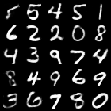
  + 采样结果

    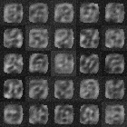
+ β = 0.03

  + 重构结果：

    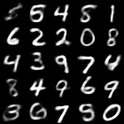
  + 采样结果：

    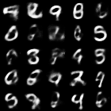
+ β = 0.05

  + 重构结果：

    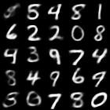
  + 采样结果：

    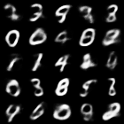
+ β = 0.1

  + 重构结果：

    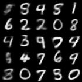
  + 采样结果：

    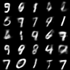
+ β = 0.12

  + 重构结果

    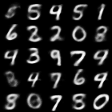
  + 采样结果

    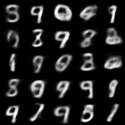
+ β = 1

  + 重构结果：

    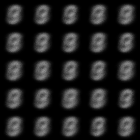
  + 采样结果：

    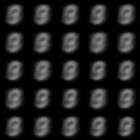

## 实验结果

最终实验的生成效果较为不错，这是因为所设计的 β-vae 和 wgan 都具有出色的潜在空间表达能力，在合适的参数下都能学得一个不错的一般隐式表达。

以下是训练过程的视频展现和最终的采样结果：

β-vae, β = 0.1, 100 epochs:

<video src="results/mp4/beta-vae.mp4"></video>

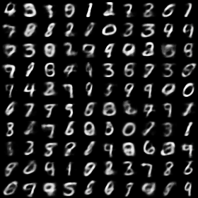

wgan, 200 epochs:

<video src="results/mp4/wgan.mp4"></video>

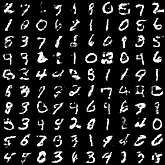

更详细的中间结果，请前往 `./intermediate/` 下对应文件夹

## 参考资料

+ [[1312.6114\] Auto-Encoding Variational Bayes (arxiv.org)](https://arxiv.org/abs/1312.6114)
+ [[1701.07875\] Wasserstein GAN (arxiv.org)](https://arxiv.org/abs/1701.07875)
+ [JGAN — Jittor 1.3.9.0 文档 (tsinghua.edu.cn)](https://cg.cs.tsinghua.edu.cn/jittor/assets/docs/gan-jittor.html)
