# Report - Scene Completion

## 提交文件结构

入口代码：`./src/completion.py` 或 `./src/completion.ipynb`，前者运行显著高效，但或者运行结果更加直观；

中间计算结果：`./data/pickles`，所有耗时计算的结果均使用了 `pickle` 进行存储。

```
.
├── data
│   ├── inputs
│   │   ├── input1.jpg
│   │   ├── input1_mask.jpg
│   │   ├── input1_patch.jpg
│   │   ├── input2.jpg
│   │   ├── input2_mask.jpg
│   │   ├── input2_patch.jpg
│   │   ├── input3.jpg
│   │   ├── input3_mask.jpg
│   │   ├── input3_patch.jpg
│   │   ├── input4.jpg
│   │   ├── input4_mask.jpg
│   │   ├── input4_patch.jpg
│   │   ├── input5.jpg
│   │   ├── input5_mask.jpg
│   │   └── input5_patch.jpg
│   └── pickles
│       ├── 1
│       │   ├── cross_items.pkl
│       │   ├── graph.pkl
│       │   ├── square_items.pkl
│       │   └── x.pkl
│       ├── 2
│       │   ├── cross_items.pkl
│       │   ├── graph.pkl
│       │   ├── square_items.pkl
│       │   └── x.pkl
│       ├── 3
│       │   ├── cross_items.pkl
│       │   ├── graph.pkl
│       │   ├── square_items.pkl
│       │   └── x.pkl
│       ├── 4
│       │   ├── cross_items.pkl
│       │   ├── graph.pkl
│       │   ├── square_items.pkl
│       │   └── x.pkl
│       └── 5
│           ├── cross_items.pkl
│           ├── graph.pkl
│           ├── square_items.pkl
│           └── x.pkl
├── report.assets
│   ├── best_patch.png
│   ├── blended.png
│   ├── boundary.png
│   ├── cropped_im.png
│   ├── cropped_windows.png
│   ├── graph-cut.png
│   ├── input5.jpg
│   ├── input5_mask.jpg
│   ├── input5_patch.jpg
│   ├── mvc_code.png
│   ├── patched_im.png
│   ├── result.png
│   ├── result1.jpg
│   ├── result2.jpg
│   ├── result3.jpg
│   ├── result4.jpg
│   ├── result5.jpg
│   ├── seam_mask.png
│   ├── weight.png
│   └── window.png
├── report.md
├── results
│   ├── 1.jpg
│   ├── 2.jpg
│   ├── 3.jpg
│   ├── 4.jpg
│   └── 5.jpg
└── src
    ├── __pycache__
    │   ├── blending.cpython-310.pyc
    │   ├── func.cpython-310.pyc
    │   └── mymaxflow.cpython-310.pyc
    ├── blending.py
    ├── completion.ipynb
    ├── completion.py
    ├── func.py
    ├── mymaxflow.py
    └── pipeline.py

13 directories, 70 files
```

## 算法思路及步骤

> 本部分所有说明均基于 input1，包括运算效率和结果示意图，其它输入也是类似的，完整的实验结果见 `实验结果` 部分。

### 精细匹配

首先对给定的 mask 进行二值化，保证只有纯黑或纯白，再使用 `cv2.erode` 配合圆形核，提取待补全图像距离确实区域在 80 个内的区域 B，并将其裁剪至最小包含区域 B 的矩形：

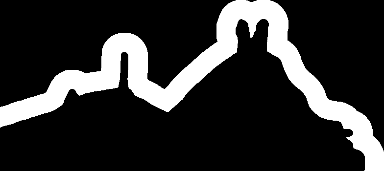

对相应裁剪后的待补全图像做 mask 后得到用于计算的 B 部分：

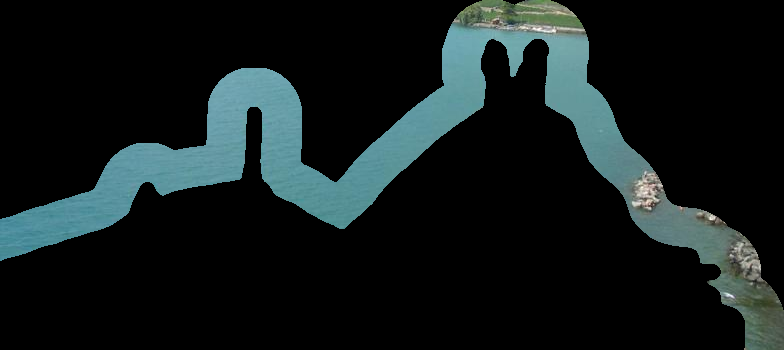

对于候选图像，将 B 部分在候选图像上平移，计算每一个位置的 $L^2$ 误差。由于 $L^2$ 误差是平方差的和的形式，根据平方差公式 $(a - b)^2 = a^2 - 2ab + b^2$，由于交叉项和平方和可以使用相关运算（也常称为卷积层，但并非数学意义上的卷积）进行预计算，而相关运算可用 FFT 加速，因而预先对交叉项和平方和进行计算可以大大降低复杂度。

本次实验提交的版本使用了 jittor 中的 nn.conv2d 以实现相关运算，猜测是由于 jittor 良好的并行性，相比于朴素实现的 FFT 加速更加高效。根据本地测试，jittor 版本的相关计算效率约为朴素实现的 FFT 加速的 5 倍。当然，即便是朴素实现的 FFT 加速也是朴素计算效率的约 4 倍。

最终找到的最佳补全部分：


### 计算融合边界

对上一步得到的模糊区域按照如下策略进行建图：

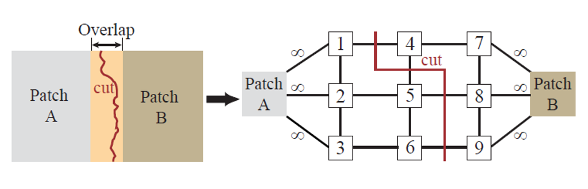

为了得到边界，本实验使用 `cv2.dilate` 配合直径为 5 的圆形核，运算后减去上一步骤中得到的 mask 的 B 区域，以此得到 Patch A 的边界和 Patch B 的边界：

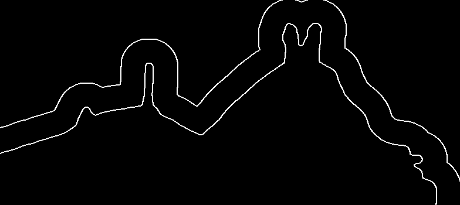

与边界的点有关的边的边权均为 inf，其余点的边权值通过下式计算：

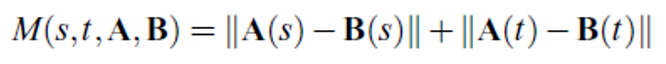

注意，式中的 A 和 B 在本实验中均使用的是梯度图而非原图，经实验，这样会有更好的效果。

此图显然为稀疏图，为了避免占用过多内存同时保证计算的高效，本实验的实现使用了链式前向星（一种邻接表）进行图的存储。建图完成后便通过网络流的最大流最小割算法进行 GraphCut 问题的求解，本实验中选取的是 Edmonds-Karp 算法。需要说明的是，由于自主实现的 Edmonds-Karp 算法是使用 python 完成的，而 pymaxflow 底层是使用 C/C++ 来实现的，因此前者效率显著不及后者。最后再进行宽搜确定节点的归属，即可得到 GraphCut 后的结果：

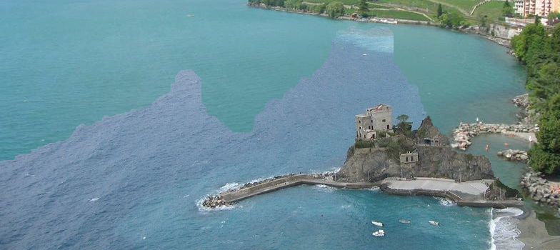

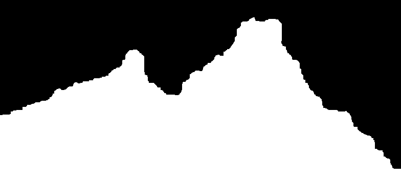

### 自然融合

使用泊松融合将图像进行融合，在构建时使用 `sp.lil_matrix` 和在计算时使用 `sp.csr_matrix` 进行存储，自主实现了高效的泊松融合矩阵的构建和稀疏矩阵迭代的求解。构建时使用了拉普拉斯核配合卷积层进行进一步加速，求解时使用了 Jacobi 迭代法以实现高效求解。

此外，在对 RGB 通道分别求解时，本实验还使用了 `concurrent.futures` 进行并行加速计算，实验证明能几乎实现 3:1 的加速比。事实上曾尝试并完成了 mvc 加速，由于没有使用多边形去近似，而是为边界上相邻像素点两两连接，因此加速效果并不好，没有放在最终的实验提交中：

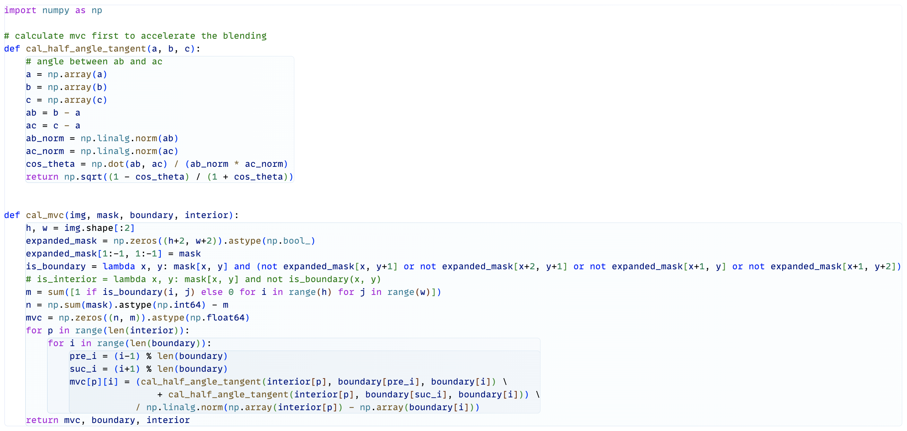

得到的自然融合结果如下：

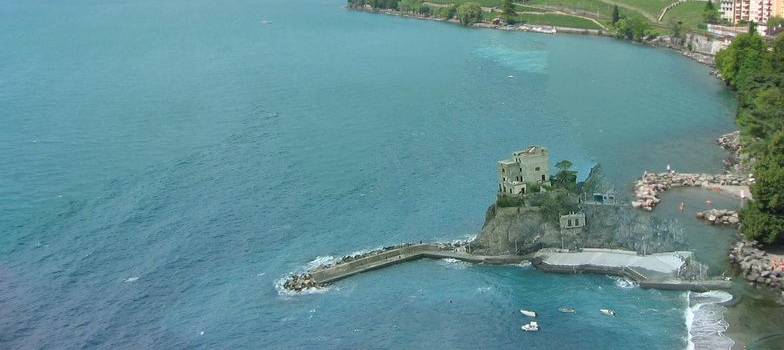

最后再将其放回至待补全图像的相应位置即可得到最终结果：


## 实现的得分点

+ 使用计图实现卷积（10分）
+ 自主完成建图，并自主实现 GraphCut 算法（10分）
+ 自主构建泊松融合矩阵、实现稀疏矩阵迭代求解算法（8分）
+ 实验报告（?/4分）
+ 代码易读、有注释（?/2分）
+ 实验结果好（?/2分）

## 实验结果

> 实际运行 .py 文件的时间要远短于在 Jupyter Notebook 中标记所需的时间。

在本地的 9th Generation Intel Core i7 上测试，对于每份输入，全流程约耗时 15 分钟，在更现代的处理器中这个结果应该会好不少；由此可见，本实现结果速度快、质量高。

下面是给定的代补全图像的补全结果：

+ 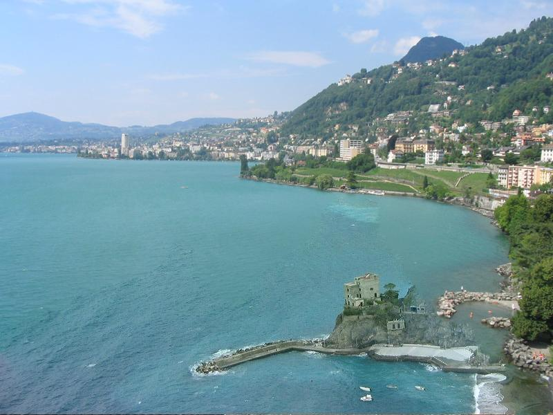
+ 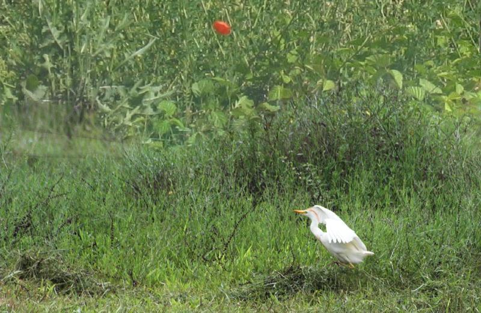
+ 
+ 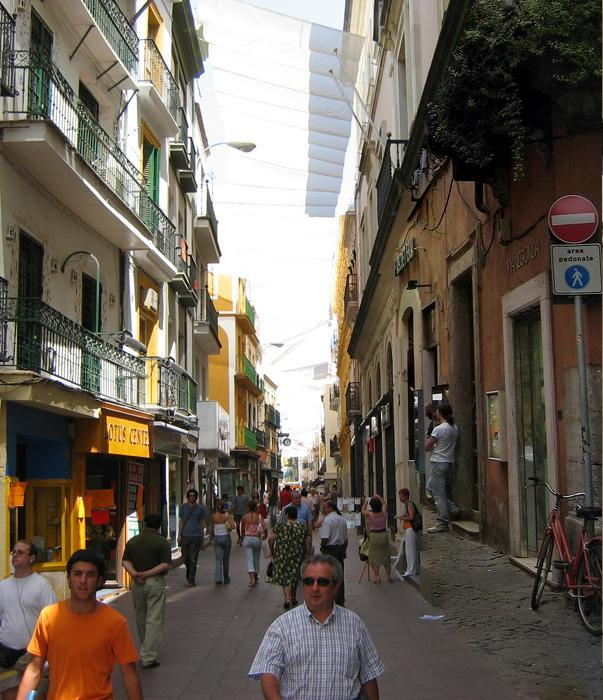

以下是额外的图像补全测试：

+ input:

  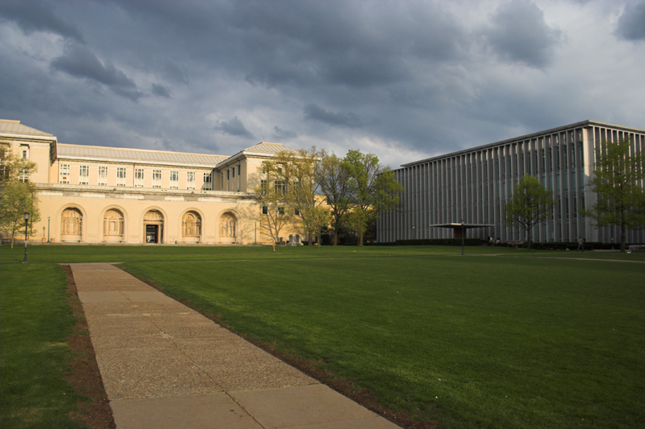
+ input_mask:

  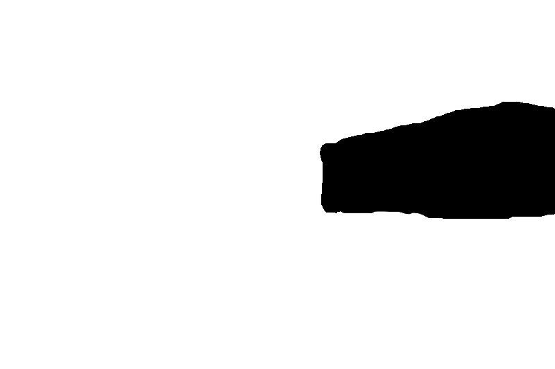
+ input_patch:

  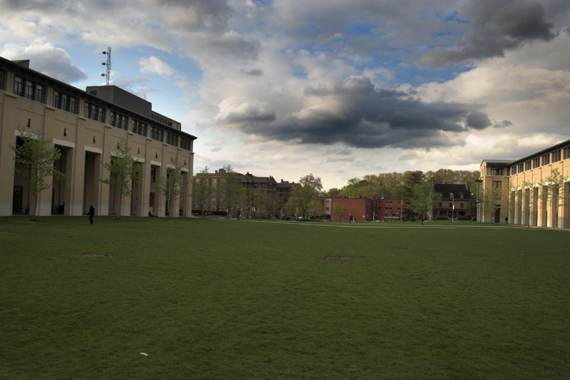
+ result:

  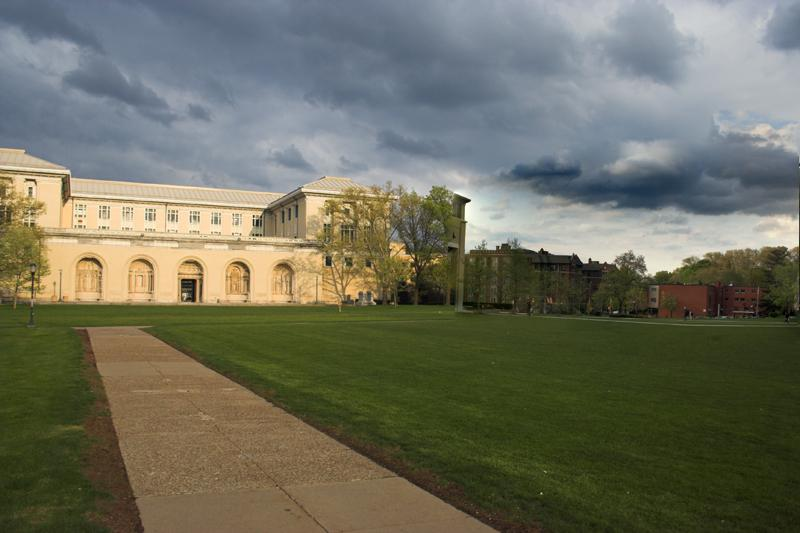

## 参考资料

+ [jittor.nn — Jittor 1.3.9.0 文档 (tsinghua.edu.cn)](https://cg.cs.tsinghua.edu.cn/jittor/assets/docs/jittor.nn.html)
+ [Edmonds–Karp algorithm - Wikipedia](https://en.wikipedia.org/wiki/Edmonds–Karp_algorithm)
+ [GitHub - opencv/opencv: Open Source Computer Vision Library](https://github.com/opencv/opencv)
+ [scene-completion.pdf (cmu.edu)](http://graphics.cs.cmu.edu/projects/scene-completion/scene-completion.pdf)
